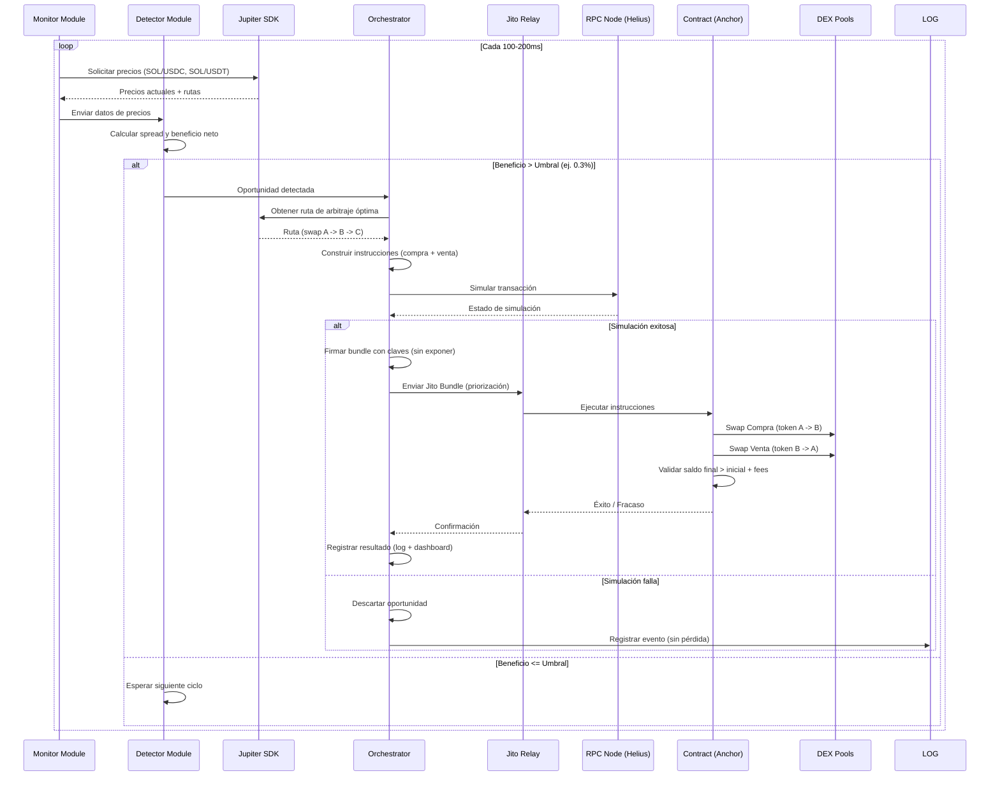
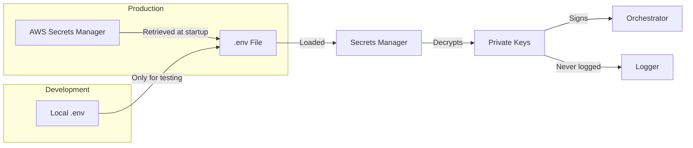
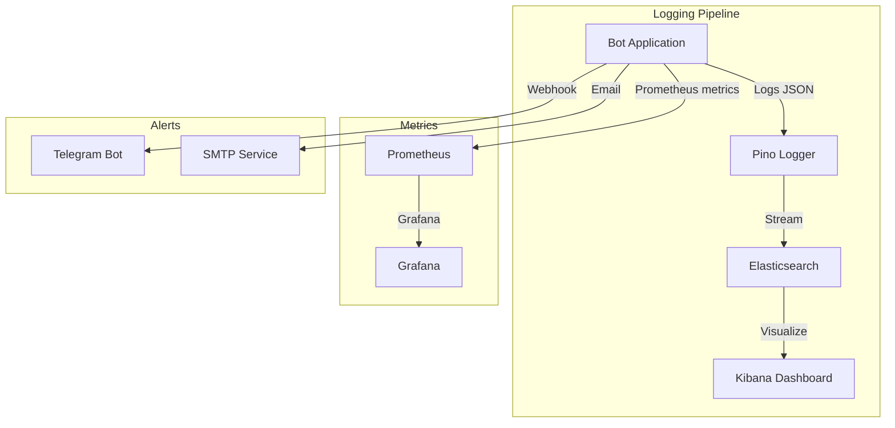

# ARCHITECTURE.md - Solana MEV Arbitrage Bot Infrastructure

## 🏛️ Visión General de Arquitectura

Este documento describe la infraestructura técnica del bot de arbitraje MEV para Solana, detallando la comunicación entre componentes, estrategias de baja latencia y la separación de responsabilidades entre el motor off-chain (Node.js/TypeScript) y el programa on-chain (Rust/Anchor).

---

## 📡 Diagrama de Arquitectura de Alto Nivel

```mermaid
flowchart TB
    subgraph "User Interface Layer"
        UI[Dashboard Web<br/>React + Chart.js]
    end

    subgraph "Off-Chain Engine (Node.js/TypeScript)"
        direction TB
        MON[Monitor Module<br/>Price Fetcher]
        DET[Detector Module<br/>Opportunity Calculator]
        ORC[Orchestrator Module<br/>Bundle Builder]
        LOG[Logger Module<br/>Pino + Elasticsearch]
        SEC[Secrets Manager<br/>AWS Secrets Manager]
    end

    subgraph "External Services"
        JUP[Jupiter SDK<br/>Price Quotes & Routes]
        RPC1[Primary RPC<br/>Helius]
        RPC2[Secondary RPC<br/>Triton]
        RPC3[Fallback RPC<br/>QuickNode]
        JITO[Jito Relay<br/>Bundle Endpoint]
        WS[WebSocket<br/>Mempool Monitoring]
    end

    subgraph "On-Chain Layer (Rust/Anchor)"
        CONTRACT[Arbitrage Executor<br/>Program ID: xxx]
        RAY[Raydium Pool]
        ORCA[Orca Pool]
        MET[Meteora Pool]
    end

    UI -->|REST API| ORC
    MON -->|HTTP| JUP
    MON -->|WebSocket| WS
    MON -->|RPC| RPC1
    MON -->|RPC (fallback)| RPC2
    MON -->|RPC (fallback)| RPC3
    DET -->|Read| MON
    ORC -->|Fetches routes| JUP
    ORC -->|Sends Bundle| JITO
    ORC -->|Signs & Submits| CONTRACT
    ORC -->|Logs| LOG
    ORC -->|Retrieves keys| SEC
    CONTRACT -->|Swap| RAY
    CONTRACT -->|Swap| ORCA
    CONTRACT -->|Swap| MET
    JITO -->|Confirms| CONTRACT
    JITO -->|Returns status| ORC
```

---

## 🔄 Flujo de Transacción (Secuencia Detallada)



---

## 🧩 Componentes Detallados

### 1. Off-Chain Engine (Node.js/TypeScript)

| Módulo              | Tecnología                          | Responsabilidad                                                             |
| ------------------- | ----------------------------------- | --------------------------------------------------------------------------- |
| **Monitor**         | `@solana/web3.js`, `@jup-ag/api`    | Consulta precios de Jupiter (REST + WebSocket) y mantiene caché de precios. |
| **Detector**        | TypeScript (cálculo con Decimal.js) | Calcula spreads y beneficio neto (incluyendo fees y slippage).              |
| **Orchestrator**    | `jito-ts`, `@coral-xyz/anchor`      | Construye y firma Jito Bundles; gestiona reintentos y fallbacks.            |
| **Logger**          | `pino`, `winston`                   | Registra eventos estructurados (JSON) para auditoría y debugging.           |
| **Secrets Manager** | `dotenv` + AWS SDK                  | Gestiona claves privadas y variables de entorno de forma segura.            |

### 2. On-Chain Layer (Rust/Anchor)

| Componente             | Función                                                                      |
| ---------------------- | ---------------------------------------------------------------------------- |
| **Arbitrage Executor** | Programa principal que ejecuta swaps atómicos (compra/venta).                |
| **Validation Logic**   | Verifica saldo inicial vs. final; revierte si beneficio < 0.                 |
| **Pool Integrations**  | Interactúa con Raydium, Orca y Meteora via CPIs (Cross-Program Invocations). |

### 3. Infraestructura de Red

| Servicio           | Proveedor              | Propósito                                            |
| ------------------ | ---------------------- | ---------------------------------------------------- |
| **RPC Primario**   | Helius (con WebSocket) | Baja latencia (< 50ms) y soporte para transacciones. |
| **RPC Secundario** | Triton (Triton One)    | Fallback con alta disponibilidad.                    |
| **RPC Terciario**  | QuickNode              | Último recurso para evitar downtime.                 |
| **Jito Relay**     | Jito Network           | Envío de bundles privados (evita frontrunning).      |

---

## ⚡ Estrategia de Baja Latencia

| Técnica                     | Implementación                                                               |
| --------------------------- | ---------------------------------------------------------------------------- |
| **Caching de Precios**      | Cache en memoria con TTL de 200ms (evita llamadas innecesarias a Jupiter).   |
| **Conexiones Persistentes** | WebSocket para suscripción a cambios de cuentas (mempool).                   |
| **Geolocalización**         | EC2 en `us-east-1` (cerca de los RPCs de Solana).                            |
| **Compresión de Datos**     | Serialización binaria (Borsh) para instrucciones.                            |
| **Reintentos Asincrónicos** | Envío paralelo a múltiples Jito Relays para mayor probabilidad de inclusión. |
| **Compute Budget**          | Ajuste dinámico de `computeUnitPrice` según congestión.                      |

---

## 🛡️ Seguridad y Gestión de Claves



- **Claves privadas:** Nunca en código; se cargan desde variables de entorno (`.env`) o AWS Secrets Manager en producción.
- **Rotación de claves:** Se genera nueva clave por sesión (opcional) para minimizar exposición.
- **Permisos:** Cuenta del bot con balance mínimo para fees (0.05 SOL) y tokens para operaciones.

---

## 📊 Monitoreo y Observabilidad



- **Logs:** Estructurados con `pino` y enviados a Elasticsearch para análisis histórico.
- **Métricas:** Latencia de detección, éxito/fallo de bundles, ganancias acumuladas.
- **Alertas:** Notificaciones en tiempo real (Telegram/Slack) para:
  - Oportunidad perdida por latencia (> 500ms).
  - Transacción fallida por error de RPC.
  - Beneficio negativo (potencial pérdida).

---

## 🖥️ Infraestructura Cloud (AWS)

| Servicio                | Propósito                    | Configuración                              |
| ----------------------- | ---------------------------- | ------------------------------------------ |
| **EC2 (t3.medium)**     | Host del bot Node.js         | `us-east-1`, SSD NVMe, Ubuntu 22.04.       |
| **ElastiCache (Redis)** | Cache de precios (opcional)  | TTL de 5s para reducir llamadas a Jupiter. |
| **Secrets Manager**     | Almacenamiento de claves     | Rotación automática cada 30 días.          |
| **CloudWatch**          | Monitoreo de logs y métricas | Alarmas para CPU > 80% o errores críticos. |
| **S3**                  | Backup de logs históricos    | Retención de 30 días.                      |

---

## 🔄 Estrategia de Reintentos y Fallback

| Escenario                     | Acción                                                                 |
| ----------------------------- | ---------------------------------------------------------------------- |
| **RPC Primario Falló**        | Cambiar al RPC Secundario (Triton) en < 100ms.                         |
| **Jito Bundle Rechazado**     | Reintentar con `computeUnitPrice` + 10% hasta 5 veces.                 |
| **Simulación Falló**          | Descartar oportunidad y registrar causa (ej. falta de liquidez).       |
| **Transacción no Confirmada** | Esperar 3 bloques; si no se confirma, reenviar con mayor priorización. |
| **Error en Contrato**         | Congelar el bot y notificar al administrador (pérdida potencial).      |

---

## 🧪 Entornos de Despliegue

| Entorno        | Propósito                 | Cluster | RPCs                        |
| -------------- | ------------------------- | ------- | --------------------------- |
| **Desarrollo** | Pruebas unitarias         | Devnet  | Helius Devnet               |
| **Staging**    | Simulaciones de arbitraje | Testnet | Helius Testnet + Triton     |
| **Producción** | Operaciones reales        | Mainnet | Helius + Triton + QuickNode |

---

## 📦 Dependencias Críticas

| Componente          | Versión | Propósito                      |
| ------------------- | ------- | ------------------------------ |
| `@solana/web3.js`   | 1.87.x  | Conexión RPC y transacciones.  |
| `@coral-xyz/anchor` | 0.29.x  | Framework del contrato.        |
| `jito-ts`           | Última  | SDK para Jito Bundles.         |
| `@jup-ag/api`       | 6.x     | Precios y rutas de Jupiter.    |
| `pino`              | 8.x     | Logging estructurado.          |
| `decimal.js`        | 10.x    | Cálculos financieros precisos. |

---

## 🚀 Plan de Escalabilidad

- **Horizontal:** Múltiples instancias EC2 con balanceo de carga (NLB) para monitorear diferentes pares.
- **Vertical:** Aumentar recursos (CPU/RAM) si la latencia supera los 200ms.
- **Mempool:** Implementar suscripción a WebSocket de Helius para detección más rápida.
- **Base de Datos:** Migrar de logs locales a TimescaleDB para análisis de series temporales.

---

## 🛠️ Herramientas de Desarrollo y CI/CD

| Herramienta           | Uso                                         |
| --------------------- | ------------------------------------------- |
| **GitHub Actions**    | CI/CD: tests, build, despliegue a EC2.      |
| **Jest**              | Pruebas unitarias (off-chain).              |
| **Anchor Test**       | Pruebas de integración (on-chain).          |
| **ESLint + Prettier** | Estilo y calidad de código.                 |
| **Docker**            | Contenerización para entornos consistentes. |

---

## 📝 Notas Finales

- Esta arquitectura prioriza **baja latencia y separación de responsabilidades**.
- Todo el código crítico (cálculo de beneficio, firma de bundles) debe ser probado en simulación antes de producción.
- Documentar cualquier cambio en `CHANGELOG.md` y actualizar este diagrama si se modifica el flujo.
```