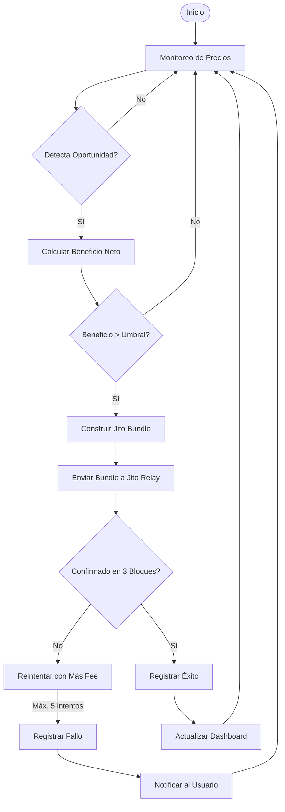
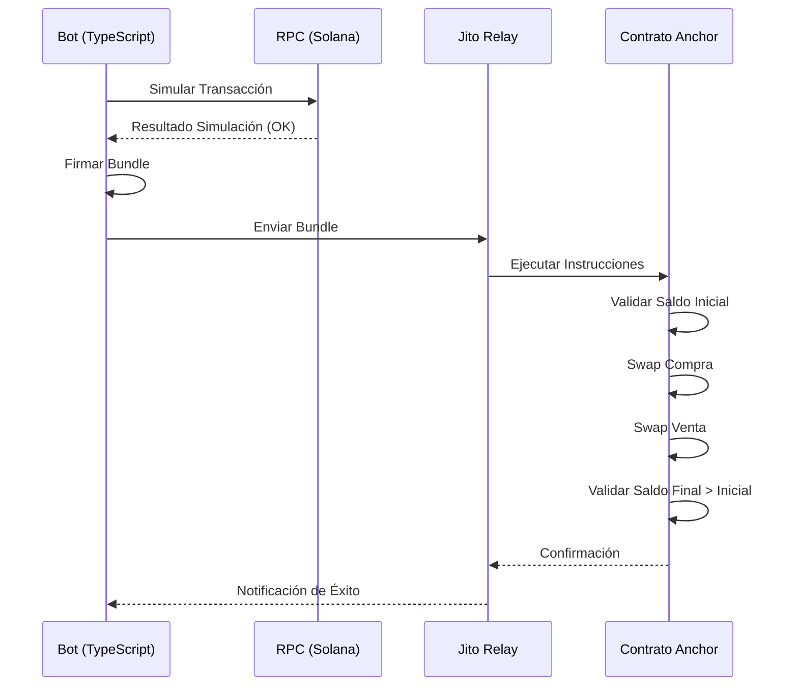

# spec.md - Solana MEV Arbitrage Bot

## Visión General

**Producto:** Bot de arbitraje MEV profesional para Solana que identifica y ejecuta oportunidades de arbitraje entre pools de Raydium, Orca y Meteora utilizando el SDK de Jupiter.

**Objetivo:** Maximizar ganancias mediante la ejecución de operaciones atómicas de compra/venta en un solo bloque, minimizando pérdidas por slippage y fees, y protegiéndose contra frontrunning mediante Jito Bundles.

**Valor Agregado:** Interfaz web que muestra información en tiempo real y permite trading manual o automatizado con las mejores estrategias configuradas.

---

## Alcance del Producto

### Incluye
- Monitoreo continuo de precios en DEXs (Raydium, Orca, Meteora).
- Detección y cálculo de oportunidades de arbitraje (ruta de 2 o 3 pasos).
- Ejecución atómica mediante Jito Bundles.
- Panel web para visualización de datos históricos y en tiempo real.
- Configuración de estrategias y parámetros de trading.
- Sistema de logs y alertas.

### No Incluye
- Arbitraje entre blockchains (solo Solana).
- Ordenes límite o stop-loss (solo arbitraje flash).
- Integración con exchanges centralizados (CEX).
- Liquidación de posiciones (solo arbitraje oportunista).

---

## 👤 Usuarios y Stakeholders

| Perfil                 | Descripción                                                   | Motivación                                            |
| ---------------------- | ------------------------------------------------------------- | ----------------------------------------------------- |
| **Trader Minorista**   | Usuario final que desea obtener ganancias pasivas con el bot. | Configura estrategias y monitorea rendimiento.        |
| **Trader Profesional** | Usuario avanzado que ajusta parámetros de latencia y fees.    | Maximiza ROI con configuraciones personalizadas.      |
| **Administrador**      | Supervisa el estado del sistema y la salud de los RPCs.       | Garantiza disponibilidad y seguridad.                 |
| **Desarrollador**      | Mantiene y mejora el código base.                             | Facilita la integración de nuevos DEXs o estrategias. |

---

## Requerimientos Funcionales

### RF-01: Monitoreo de Precios
- **Descripción:** El sistema debe consultar precios de tokens en Raydium, Orca y Meteora cada 100-200ms.
- **Fuentes:** SDK de Jupiter (v6), WebSocket de RPCs.
- **Métrica:** Latencia < 150ms para detección de oportunidad.

### RF-02: Detección de Oportunidades
- **Descripción:** Calcular automáticamente el beneficio neto para rutas de arbitraje de 2 o 3 pasos.
- **Algoritmo:** Beneficio = (Monto Venta - Monto Compra) - (Fees + Slippage + Jito Tip).
- **Condición:** Solo ejecutar si beneficio > umbral configurable (ej. 0.3%).

### RF-03: Ejecución Atómica
- **Descripción:** Enviar transacciones a través de Jito Bundles para garantizar atomicidad.
- **Contrato Anchor:** Valida el saldo inicial y final para asegurar beneficio positivo.
- **Firma:** Usar clave privada del bot (almacenada en variables de entorno).

### RF-04: Panel Web
- **Descripción:** Interfaz web con:
  - Tablero de oportunidades detectadas (en tiempo real).
  - Historial de transacciones ejecutadas (éxito/fallo).
  - Configuración de estrategias (umbral de beneficio, slippage, fees).
  - Gráficos de rendimiento (ganancias diarias/semanales).

### RF-05: Logs y Alertas
- **Descripción:** Registrar todas las acciones y errores en formato estructurado (JSON).
- **Alertas:** Enviar notificaciones a Telegram/Slack si:
  - Oportunidad perdida por latencia.
  - Transacción fallida.
  - Error crítico en RPC.
  - Transaccion existosa.

---

## Lógica de Negocio

### Cálculo de Beneficio Neto
Beneficio = (Cantidad_Salida * Precio_Venta) - (Cantidad_Entrada * Precio_Compra) - (Fee_Jupiter + Fee_Jito + Slippage)

- **Slippage estimado:** 0.5% por defecto (configurable).
- **Fee Jito:** Fijo + priorización dinámica (según congestión).
- **Fee Jupiter:** 0.1% - 0.3% por swap.
- **Umbral mínimo:** Beneficio > 0.1 USDC (evita pérdidas por comisiones).

### Validación On-chain
El contrato Anchor verificará:
1. Saldo inicial del token de entrada.
2. Saldo final del token de salida.
3. Confirmar que `Saldo_Final > Saldo_Inicial + Gas_Estimado`.

---

## Casos de Uso

### CU-01: Arbitraje Exitoso
1. **Pre-condición:** Oportunidad detectada con beneficio > umbral.
2. **Flujo:**
   - Construir Jito Bundle con instrucciones de compra y venta.
   - Firmar y enviar al relay de Jito.
   - Esperar confirmación (hasta 3 bloques).
3. **Post-condición:** Se registra el beneficio y se actualiza el dashboard.

### CU-02: Oportunidad Desaparece Antes de Ejecutar
1. **Pre-condición:** Oportunidad detectada, pero el precio cambia en < 500ms.
2. **Flujo:**
   - Simulación falla o beneficio < umbral.
   - Se aborta la transacción y se registra el evento.
   - Se notifica al usuario (opcional).
3. **Post-condición:** Se reinicia el ciclo de monitoreo.

### CU-03: Transacción Fallida por Congestión
1. **Pre-condición:** Bundle enviado pero no confirmado en 3 bloques.
2. **Flujo:**
   - Reintentar con un `computeUnitPrice` más alto (hasta 5 veces).
   - Si persiste, marcar como fallida y notificar.
3. **Post-condición:** Se liberan los fondos (sin pérdida).

---

## Diagramas de Flujo

### Flujo General del Bot

## Diagrama de Secuencia de la Ejecución

## Umbrales de Seguridad
| Parámetro             | Valor por Defecto | Descripción                                          |
| --------------------- | ----------------- | ---------------------------------------------------- |
| Slippage Máximo       | 0.5%              | Evita pérdidas por volatilidad extrema.              |
| Beneficio Mínimo      | 0.1 USDC          | Previene ejecución de oportunidades no rentables.    |
| Gas Máximo (Jito)     | 0.005 SOL         | Límite de priorización para evitar costos excesivos. |
| Reintentos            | 5                 | Número de intentos antes de descartar oportunidad.   |
| Timeout de Simulación | 1s                | Si simulación excede, cancelar.                      |

## Requerimientos No Funcionales
| Área           | Especificación                                                         |
| -------------- | ---------------------------------------------------------------------- |
| Rendimiento    | Latencia de detección < 200ms; ejecución < 2 bloques.                  |
| Disponibilidad | 99.9% de uptime (RPCs redundantes).                                    |
| Seguridad      | Claves privadas cifradas en .env; sin exposición en logs.              |
| Escalabilidad  | Soporte para múltiples tokens y pares (configurable).                  |
| Mantenibilidad | Código modular con pruebas unitarias (Jest) y de integración (Anchor). |

## Criterios de Aceptación

1. Cobertura de Tests: > 80% en módulos críticos (detección, cálculo, bundle).
2. Ejecución Exitosa: Al menos 1 arbitraje real en mainnet con beneficio > 0.1 USDC en 24h.
3. Dashboard Funcional: Visualiza en tiempo real oportunidades y transacciones.
4. Logs Completos: Registro detallado de cada ciclo, incluyendo simulaciones fallidas.
5. Configuración Dinámica: Ajuste de umbrales y slippage sin reiniciar el bot.

## Plan de Entregas (Roadmap)
| Fase   | Hito                     | Entregable                                      |
| :----- | :----------------------- | :---------------------------------------------- |
| Fase 1 | Monitoreo y Detección    | Módulo de precios funcional (Jupiter).          |
| Fase 2 | Ejecución y Jito         | Contrato Anchor desplegado y pruebas de bundle. |
| Fase 3 | Dashboard y Logs         | Frontend básico con conexión a backend.         |
| Fase 4 | Optimización y Seguridad | Mejora de latencia y gestión de claves.         |
| Fase 5 | Producción y Monitoreo   | Despliegue en mainnet con alertas.              |

## Dependencias y Riesgos
Dependencias Externas
- Jupiter SDK: Cambios de API pueden afectar el cálculo de rutas.
- Jito Network: Disponibilidad y fees dinámicos.
- RPCs de Solana: Latencia y estabilidad (uso de múltiples proveedores).

## Riesgos y Mitigación
| Riesgo            | Impacto                       | Mitigación                             |
| :---------------- | :---------------------------- | :------------------------------------- |
| Falla de RPC      | Alto (pérdida de oportunidad) | Fallback automático a 3 RPCs.          |
| Frontrunning      | Alto (pérdida de beneficio)   | Jito Bundles + simulación previa.      |
| Slippage extremo  | Medio                         | Ajuste dinámico según volatilidad.     |
| Error en contrato | Crítico                       | Pruebas exhaustivas en devnet/testnet. |

Notas Finales

- Este spec es un documento vivo; se actualizará según el feedback de pruebas y producción.
- Priorizar siempre la seguridad de los fondos sobre la velocidad de ejecución.
- Documentar cualquier desviación de este spec en el archivo CHANGELOG.md.
